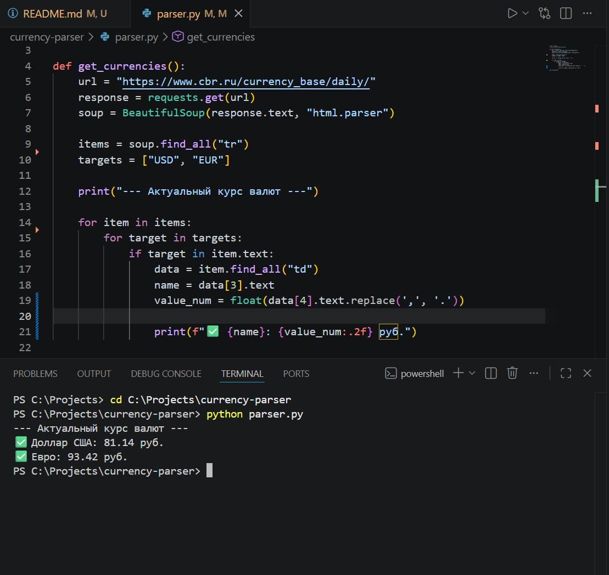
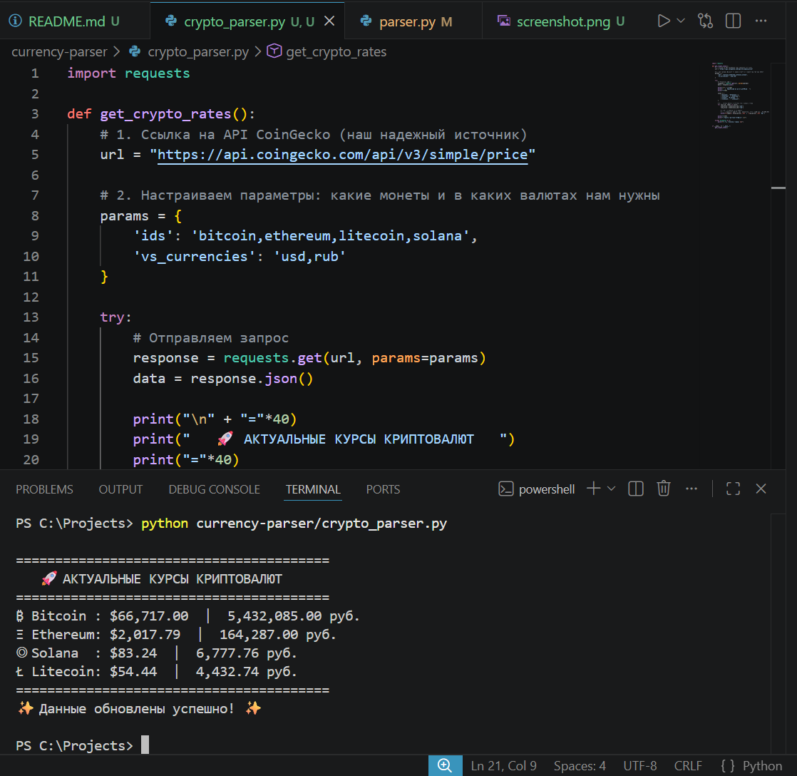

# 💰 Набор Финансовых Парсеров на Python

Добро пожаловать в репозиторий с набором простых и полезных инструментов для отслеживания курсов валют и криптовалют. Проект создан в учебных целях.

---
## 🏢 1. Парсер ЦБ РФ (`parser.py`)

Этот скрипт получает актуальный официальный курс USD и EUR с сайта Центрального Банка РФ.

**Особенности:**
* Данные берутся напрямую с cbr.ru.
* Курс выводится с округлением до 2 знаков после запятой (например, `92.50 руб.`).

### 👀 Как это выглядит:

**Запуск:**
python parser.py

---
## 🚀 2. Крипто-парсер (`crypto_parser.py`)

Этот инструмент отслеживает курсы топовых криптовалют в реальном времени, используя бесплатное API CoinGecko.

**Поддерживаемые монеты:**
* ₿ Bitcoin (в $ и руб.)
* Ξ Ethereum (в $ и руб.)
* ◎ Solana (в $ и руб.)
* Ł Litecoin (в $ и руб.)

### 👀 Как это выглядит:

**Запуск:**
python crypto_parser.py

---
### 🛠 Как запустить на своем компьютере:

1. Откройте терминал и скачайте проект:
git clone https://github.com/Alexey90h-alt/currency-parser.git

2. Установите нужные библиотеки:
pip install requests beautifulsoup4

3. Перейдите в папку проекта и запускайте нужный скрипт.

---
*Проект создан с любовью в учебных целях.* 